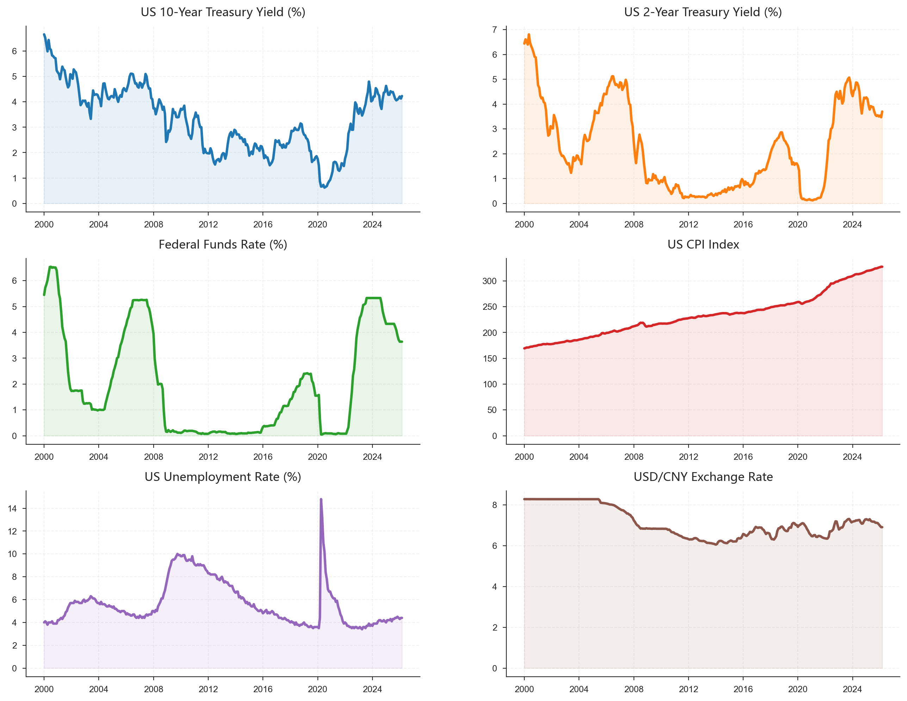
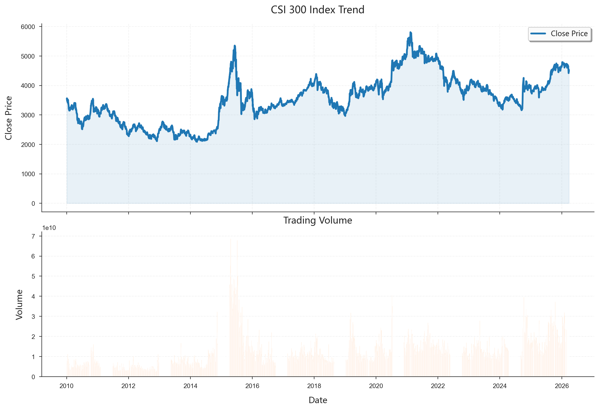
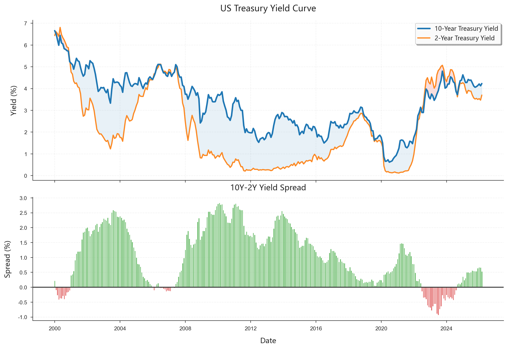
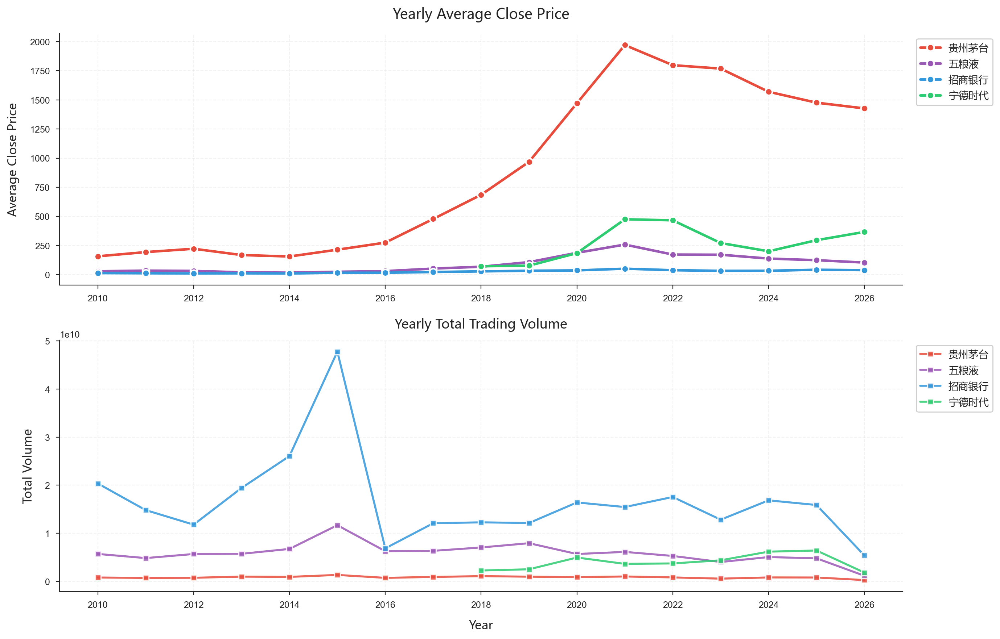
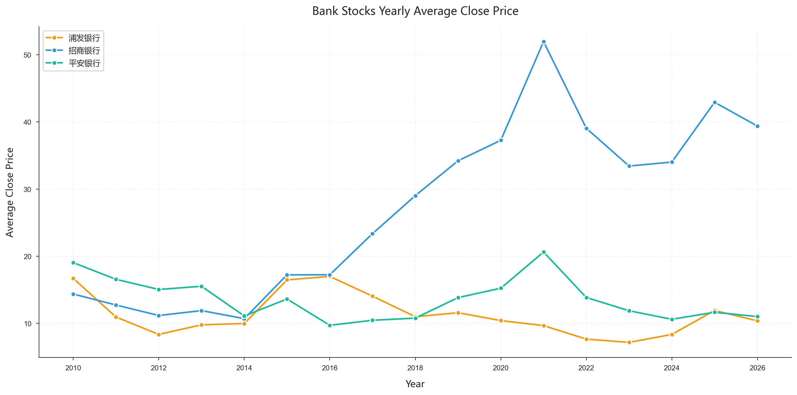
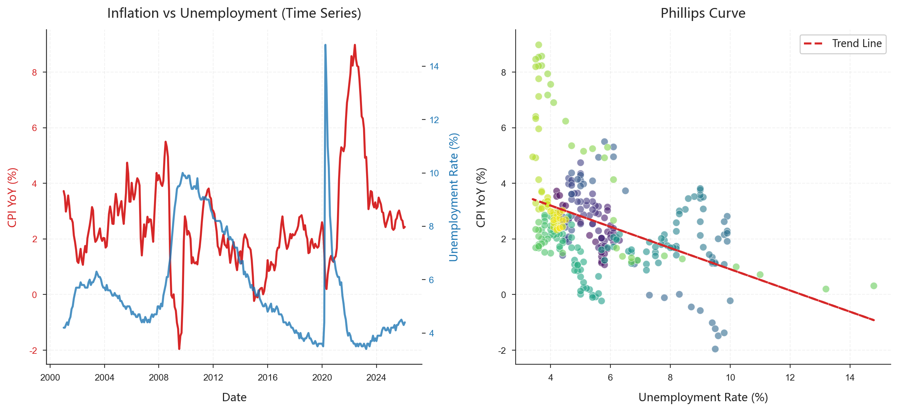
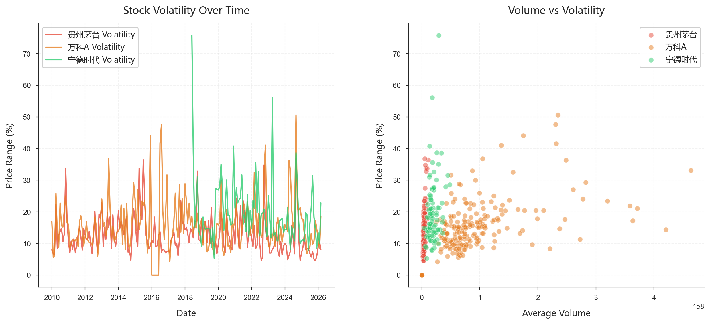
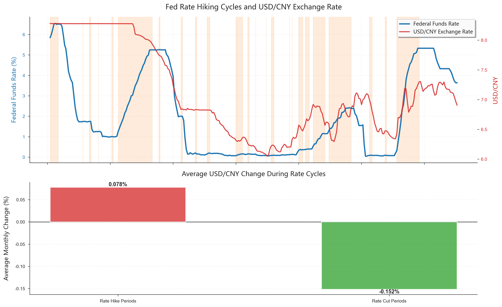

# 分析过程和主要结论

## 项目整体流程

本项目的分析工作分为三个主要阶段：

1. **数据获取阶段**：通过 API 获取原始数据
2. **数据库建立阶段**：设计并创建 SQLite 数据库
3. **分析与可视化阶段**：使用 SQL 查询进行数据分析

---

## 数据来源

### FRED 宏观经济数据

从 St. Louis Fed 的 FRED (Federal Reserve Economic Data) API 获取以下数据：

| 序列 ID | 指标名称 | 时间范围 |
|---------|----------|----------|
| CPIAUCSL | 消费者价格指数 | 2000-01-01 至 2024-12-31 |
| UNRATE | 失业率 | 2000-01-01 至 2024-12-31 |
| FEDFUNDS | 联邦基金利率 | 2000-01-01 至 2024-12-31 |
| GS10 | 10 年期国债收益率 | 2000-01-01 至 2024-12-31 |
| GS2 | 2 年期国债收益率 | 2000-01-01 至 2024-12-31 |
| DEXCHUS | 美元兑人民币汇率 | 2000-01-01 至 2024-12-31 |



### A 股市场数据

使用 baostock API 获取以下数据：

- **沪深 300 指数**（000300.SH）
- **10 只代表性股票**：包括招商银行、平安银行、贵州茅台、恒瑞医药等不同行业的龙头企业

数据范围：2020-01-01 至 2024-12-31



---

## 数据库概览

创建的 `fin_data.db` 数据库包含三个核心表：

| 表名 | 记录数 | 说明 |
|------|--------|------|
| `macro_data` | 1,887 | 宏观经济数据 |
| `stock_price` | 41,194 | 股票行情数据 |
| `stock_info` | 11 | 股票基本信息 |

---

## 主要分析内容与结论

### 收益率曲线利差分析

**分析目标**：计算 10 年期与 2 年期国债收益率的利差（10Y-2Y），这是预测经济衰退的重要指标。

**SQL 查询方法**：使用 `CASE WHEN` 语句将长表转为宽表，然后计算利差。


```sql
SELECT
    date,
    MAX(CASE WHEN series_id = 'GS10' THEN value END) AS gs10,
    MAX(CASE WHEN series_id = 'GS2' THEN value END) AS gs2,
    MAX(CASE WHEN series_id = 'GS10' THEN value END) -
    MAX(CASE WHEN series_id = 'GS2' THEN value END) AS yield_spread
FROM macro_data
WHERE series_id IN ('GS10', 'GS2')
GROUP BY date
ORDER BY date;
```



**主要发现**：
- 收益率曲线利差在经济危机期间（如 2008 年、2020 年）出现剧烈波动
- 利差收窄甚至倒挂往往预示着经济下行压力增大

---

### 股票年度统计分析

**分析目标**：计算每只股票的年度平均收盘价和总成交量，观察长期趋势。

**SQL 查询方法**：使用 `substr()` 提取年份，配合 `GROUP BY` 进行聚合。

```sql
SELECT
    code,
    substr(date, 1, 4) AS year,
    AVG(close) AS avg_close,
    SUM(volume) AS total_volume
FROM stock_price
GROUP BY code, year
ORDER BY code, year;
```



**主要发现**：
- 不同股票的年度表现差异显著
- 成交量与股价波动存在一定相关性
- 银行股表现相对稳健，消费股波动较大

---

### 银行股筛选分析

**分析目标**：筛选出银行行业且上市超过 10 年的股票。

**SQL 查询方法**：多条件筛选，使用 `DATE()` 函数计算上市年限。

```sql
SELECT
    si.code,
    si.name,
    si.industry,
    si.list_date,
    DATE('now') - DATE(si.list_date) AS years_listed
FROM stock_info si
WHERE
    si.industry = '银行'
    AND DATE('now') - DATE(si.list_date) >= 10
ORDER BY si.list_date;
```



**筛选结果**：
1. 浦发银行
2. 招商银行
3. 平安银行

---

### 菲利普斯曲线验证

**分析目标**：探索 CPI（通胀率）与失业率之间的关系，验证菲利普斯曲线理论。

**SQL 查询方法**：将 CPI 和失业率数据进行联结，然后分析相关性。



**主要发现**：
- 短期来看，通胀与失业率确实存在一定的替代关系
- 但长期来看，这种关系并不稳定，受多种因素影响

---

### 股票波动率与成交量关系

**分析目标**：分析股票价格波动率与成交量之间的关系。

**SQL 查询方法**：计算每日价格振幅（(high-low)/close）作为波动率指标，然后与成交量对比。



**主要发现**：
- 高成交量往往伴随着高波动率
- 在市场剧烈波动时期，成交量显著放大

---

### 美联储政策对人民币汇率的影响（完整分析流程）

**分析目标**：研究美联储加息/降息周期对美元兑人民币汇率的影响。

**分析步骤**：
1. 识别美联储的加息和降息周期
2. 计算不同周期内的汇率月度变动
3. 对比分析差异



**主要结论**：

| 政策周期 | 平均月度汇率变动 |
|----------|-----------------|
| 加息期间 | +0.0779% |
| 降息期间 | -0.1517% |

**解读**：
- 美联储加息期间，美元趋于走强，人民币相对贬值（汇率上升）
- 美联储降息期间，美元趋于走弱，人民币相对升值（汇率下降）
- 这一结果符合利率平价理论的预期

---

## 本章小结

本项目通过 API 获取了丰富的金融市场数据，建立了结构化的 SQLite 数据库，并完成了多个维度的分析。主要收获包括：

1. **数据获取能力**：掌握了使用 API 获取经济金融数据的方法
2. **数据库管理能力**：学会了设计和管理关系型数据库
3. **分析能力**：能够运用 SQL 进行复杂的数据查询和分析
4. **可视化能力**：通过图表直观展示分析结果

下一章将详细介绍本项目中使用的 SQLite 技术。
